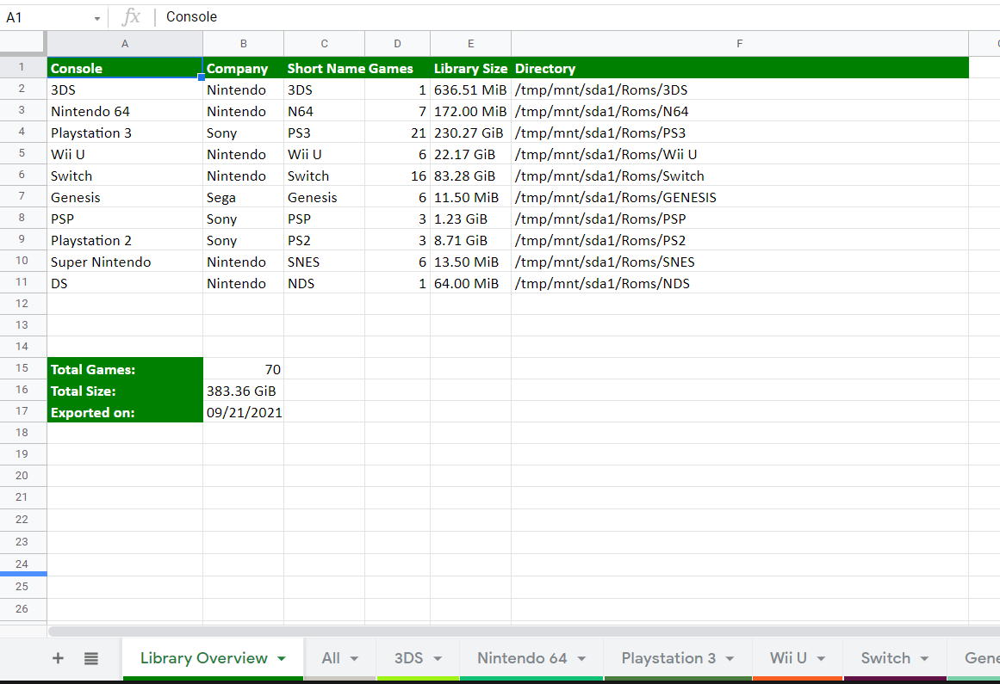
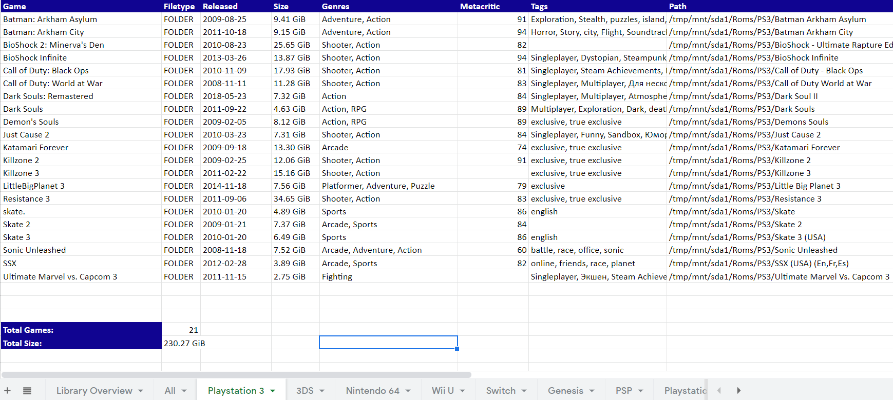

# game_archive_xl_export
Configurable and automatic spreadsheet population for a multi-console game library/archive.
This program takes an object-oriented approach and is flexible to work with very large archives of games.

## Setup and Usage
- Clone the repo into you existing directory where all of your games are
  - the **game_archive_xl_export** directory should be at the same level as your console subdirectories
- Install the dependencies `pip install -r requirements`
- Run the script to generate the spreadsheet `./game_archive_xl_export/main.py`
- This can be configured to run on a schedule using `cron` or any other task scheduling software

## Additional Configuration
- Root game path and output spreadsheet paths can be configured in the `config.json` file
- Each game console can be tweaked within the `config.json` to allow for additional rom extensions to be detected, or to change the display name of a system
  - `shortName`: attribute is the directory name that the program will expect for that console's directory
  - `name`: attribute is the display name that will show in the spreadsheet tabs etc.
  - `romFormats`: list of file types that the program will consider roms (`folder` option is also available for unpacked game formats)
  - `company`: a cosmetic field for the output spreadsheet 
  ### Ignoring files and folders
  - In the case of roms being the same format as patches/dlc for a system,`update` and `dlc` directories may be included and files within them will be automatically ignored
  - Unpacked games (in folder format), will not be searched for additional roms
### Screenshots
An example **Library Overview** tab with summaries of each console's contents.

Consoles are broken out into tabs(worksheets) with more detail and breakdown of the games

### Gather More Info About Your Games (RAWG.io)
- This tool has the ability to get additional information about your game using the [RAWG](https://rawg.io) api
  - Additional field examples: **release date**, **metacritic score**, **genre**, **tags**, and more 
- To enable RAWG functionality simply set the following environment variables within your execution environment:
  - `RAWG_ENABLED`: any value will enable RAWG
  - `RAWG_API_KEY`: your key for accessing the RAWG api. [Get a RAWG API key](https://rawg.io/login?forward=developer)

### Future plans
- Containerized approach with built-in scheduling would also be a nice alternative to the manual + cron installation

## Disclaimer
- This tool in no way promotes piracy. It is a helpful tool for archivists to keep legally owned games organized and cataloged.

